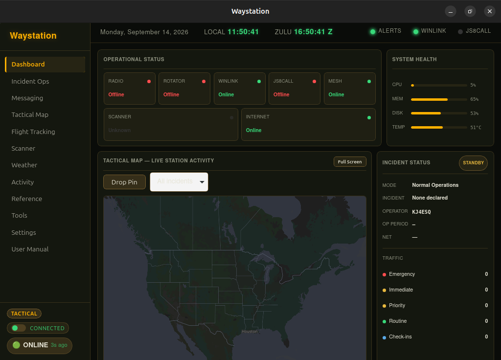
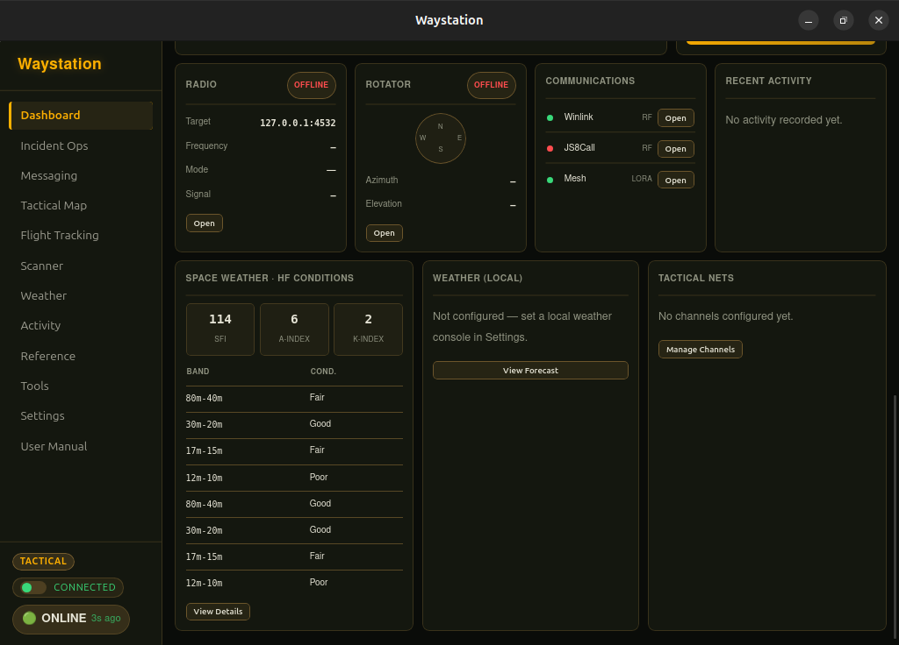

# WayStation

**Online for awareness. Offline for operations. Built to shine when the grid goes down.**

WayStation is an offline-first communications and field-operations desktop app for amateur radio, emergency communications, preparedness, and resilient local coordination. It's not a collection of ham-radio panels bolted together — its real operational loop is:

**OBSERVE → UNDERSTAND → DECIDE → COMMUNICATE → DOCUMENT → SYNCHRONIZE**

Online connectivity enriches the local operational picture while it's available. When connectivity degrades, WayStation retains cached information with honest age and provenance instead of pretending it's live. When the grid fails entirely, live RF, local hardware, nearby peers, and locally stored operational data take over — grid-down mode is the environment this app exists to serve, not a crippled fallback for when the "real" online version stops working.

<p align="center">
  
</p>

---

## Status: early public test release

This is a genuine, working build — not a prototype. Under the hood: a Rust/Tauri backend with 150+ automated tests, 45+ real panels (net control, ICS-style incident forms, mesh networking, Winlink, JS8Call, rig/rotator control, flight and satellite tracking, propagation and space-weather data, and more), and an honest internal status taxonomy that this project's own [ROADMAP.md](ROADMAP.md) uses to track exactly what's verified versus still rough.

But it's still pre-1.0 and under active field testing (a real month-long offline field trial started 2026-09-07 — this public release is an expanded, faster version of that same test, not a replacement for it). Known, honestly-disclosed gaps as of this release:

- **Two sections of the in-app manual aren't written yet**: mesh/JS8Call/rig-control setup walkthroughs, and the amateur-radio band-plan reference. Rather than guess at ham-radio-specific details (a wrong band edge is a real compliance problem, not just a typo), these are left honestly marked "not written yet" in-app until they can be done right.
- **No macOS build exists yet** — only Windows and Linux installers are produced by this release.
- Multi-node mesh networking is real and tested in isolation, but genuinely unverified with a second physical node in the field — see ROADMAP.md's own status tags for the full, current picture of what's BUILT+VERIFIED versus BUILT-BUT-HARDWARE-PENDING.

If you hit something broken, that's exactly what this release is for — please report it.

---

## Screenshots

<p align="center">
  
</p>

Radio and rotator control, live communications status, real HF propagation conditions from actual space-weather data, and local weather — all on the same dashboard, all degrading honestly when a data source isn't reachable rather than showing stale numbers as if they were current.

---

## Requirements

- **Windows 10/11**, or **Ubuntu 22.04 or newer** (or a compatible Linux distro — the `.deb` and `.AppImage` builds are produced on Ubuntu 22.04's toolchain).
- No installed dependencies needed for the packaged installer — Tauri bundles everything required.
- **Citadel is optional, not required.** WayStation is built to work standalone; a handful of features (live map tiles, an AI narrative assistant, offline encyclopedia search) enrich themselves automatically if a [Citadel](https://github.com/frankprobst5-stack/Project-Citadel) instance is reachable on your network, and fall back gracefully (verified directly in the source, not just assumed) if one isn't. You do not need to install Citadel first.

## Installing

Grab the installer for your platform from this repo's **[Releases page](../../releases)**:
- **Windows**: download and run the `.msi`.
- **Linux**: download the `.deb` (Debian/Ubuntu) or the `.AppImage` (most other distros — make it executable and run it directly, no install needed).

These installers are unsigned (no code-signing certificate is configured yet), so Windows SmartScreen or your Linux distro's package manager may warn before running them the first time — that's expected for an early test release, not a sign anything's wrong.

### Building from source instead

```bash
git clone https://github.com/frankprobst5-stack/WayStation.git
cd WayStation/app
npm install
npm run tauri build
```
Needs Node 22+ and a Rust toolchain, plus Tauri's own system dependencies (`libwebkit2gtk-4.1-dev` etc. on Linux — see [Tauri's prerequisites guide](https://tauri.app/start/prerequisites/)).

## Learn more

- **[ROADMAP.md](ROADMAP.md)** is this project's real, running engineering log — what's built and verified, what's built but hardware-pending, what's still planned, written honestly rather than aspirationally.
- Once WayStation is running, its own **User Manual panel** (in-app) covers day-to-day usage for every feature.

## License

GPL-3.0-or-later — see [LICENSE](LICENSE) if present, or the license header in [app/package.json](app/package.json).

**Important:** This covers WayStation's own original code only (everything under `app/src` and `app/src-tauri/src`) — it does not relicense anything else. Real third-party dependencies (MapLibre GL JS, PMTiles, protomaps-themes-base, React, and everything else in [app/package.json](app/package.json)) are pulled in through the normal npm package manager, not manually copied into this repo, and each keeps its own license as published — verified directly, not assumed: MapLibre GL JS, PMTiles, and protomaps-themes-base are all BSD-3-Clause; React/React-DOM are MIT. See [Citadel's THIRD_PARTY_LICENSES.md](https://github.com/frankprobst5-stack/Project-Citadel/blob/main/THIRD_PARTY_LICENSES.md) for the same libraries' real copyright holders and sources — WayStation depends on the identical set, just via npm rather than a manually-vendored copy.
